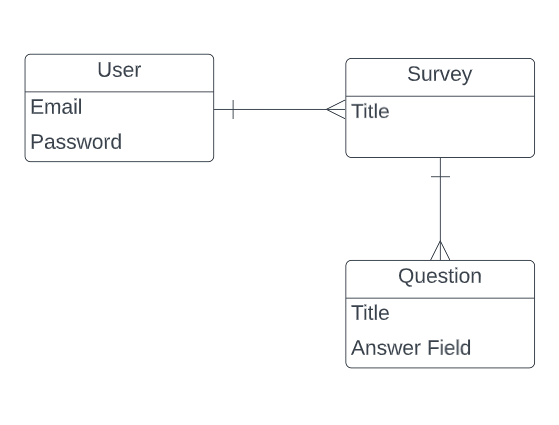

# Survey Bite

[Survey Bite](https://surveybite.github.io/SurveyBite-Client/)
[Repositories](https://github.com/orgs/SurveyBite/repositories)

### Overview:
Make a survey. Take a survey.

### Rules:
You must have an account to begin creating surveys. Create an account using the sign up link.

**_THIS IS A TOY APPLICATION. Do not enter real passwords, or passwords you have used anywhere else!_**

Once you have an account you can: make a survey, take a survey, and see your survey response

### Wireframes: 

### ERD: 

### User stories: 
- As an unregistered user, I would like to sign up with email and password.
- As a registered user, I would like to sign in with email and password.
- As a signed in user, I would like to change password.
- As a signed in user, I would like to sign out.
- As a signed in user, I would like to create a survey with a title and possible
  answers.
- As a signed in user, I would like to update my survey's title and possible
  answers of a survey.
- As a signed in user, I would like to delete my survey.
- As a signed in user, I would like to see all surveys and its answers.
- As a signed in user, I would like to take a survey.